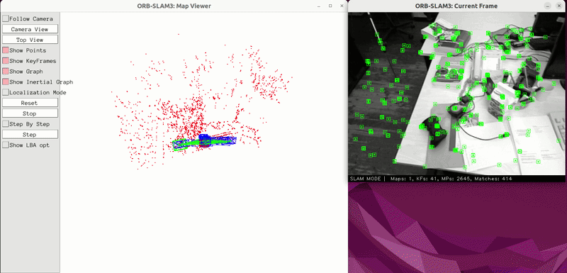
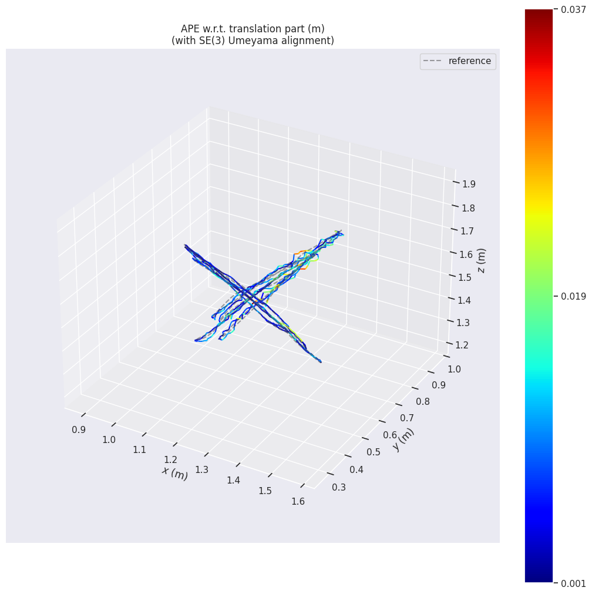
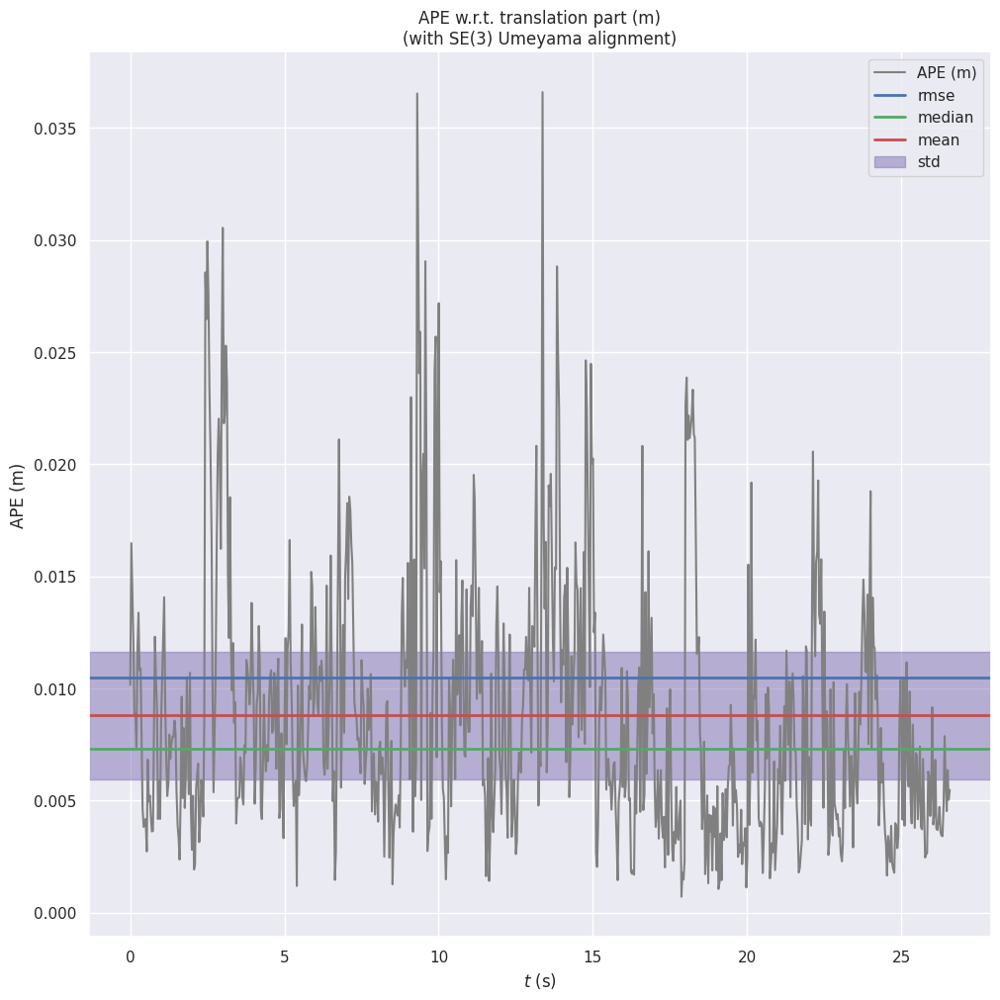

# Week 1 — ORB-SLAM3 RGB-D SLAM sur TUM Dataset



> Adaptation et exécution d'ORB-SLAM3 sur Ubuntu 22.04 avec évaluation
> quantitative de trajectoire sur le dataset TUM RGB-D freiburg1_xyz.

---

## 🎯 Objectif

Reconstruire la trajectoire d'une caméra RGB-D et cartographier
l'environnement en 3D sparse — sans GPS, sans robot physique,
uniquement à partir d'images RGB-D.

---

## 📊 Résultats

| Métrique | Valeur |
|----------|--------|
| **ATE RMSE** (APE translation) | **1.047 cm** |
| ATE Mean | 8.8 mm |
| ATE Max | 3.6 cm |
| ATE Min | 0.7 mm |
| KeyFrames | 60 |
| Map Points | 2848 |
| Images traitées | 792 |
| Temps de tracking moyen | 13.2 ms |




---

## 🧠 Ce que fait ORB-SLAM3

ORB-SLAM3 est un système SLAM (Simultaneous Localization and Mapping)
visuel qui fonctionne en **3 threads parallèles** :

- **Tracking** — suit les features ORB image par image (30 fps)
- **LocalMapping** — construit et optimise la carte locale
- **LoopClosing** — détecte les endroits déjà visités via DBoW2

Bibliothèques internes :

| Bibliothèque | Rôle |
|-------------|------|
| **DBoW2** | Reconnaissance de scènes visuelles |
| **g2o** | Optimisation de graphe de poses (Bundle Adjustment) |
| **Sophus** | Algèbre des groupes de Lie pour les rotations 3D |

---

## 🛠️ Stack technique

- **C++14** · OpenCV 4.5.4 · Eigen3 3.4 · Pangolin · CMake 3.22
- **evo** — évaluation quantitative de trajectoire
- **Dataset** : TUM RGB-D freiburg1_xyz (Microsoft Kinect)

---

## ⚙️ Problèmes résolus — Adaptation Ubuntu 22.04

| Problème | Cause | Solution |
|----------|-------|----------|
| Erreur sigslot compilation | C++11 incompatible Pangolin | Migration C++14 |
| `opencv2/core.hpp` introuvable | Chemin OpenCV 4.x modifié | Lien symbolique + `find_package` |
| `monotonic_clock` inexistant | API supprimée en C++14 | Remplacement `steady_clock` |
| `libpango_windowing.so` manquant | Cache ldconfig vide | `sudo ldconfig` |
| Conflit matplotlib apt/pip | Deux versions coexistantes | Suppression version apt |

---

## 🚀 Reproduire le projet

```bash
# 1. Cloner ORB-SLAM3
git clone https://github.com/UZ-SLAMlab/ORB_SLAM3.git
cd ORB_SLAM3 && ./build.sh

# 2. Télécharger le dataset TUM
mkdir -p ~/datasets/tum && cd ~/datasets/tum
wget https://cvg.cit.tum.de/rgbd/dataset/freiburg1/rgbd_dataset_freiburg1_xyz.tgz
tar -xzf rgbd_dataset_freiburg1_xyz.tgz
wget https://raw.githubusercontent.com/raulmur/ORB_SLAM2/master/Examples/RGB-D/associations/fr1_xyz.txt

# 3. Lancer ORB-SLAM3
cd ~/ORB_SLAM3
./Examples/RGB-D/rgbd_tum Vocabulary/ORBvoc.txt \
  Examples/RGB-D/TUM1.yaml \
  ~/datasets/tum/rgbd_dataset_freiburg1_xyz \
  ~/datasets/tum/fr1_xyz.txt

# 4. Évaluer la trajectoire
evo_ape tum \
  ~/datasets/tum/rgbd_dataset_freiburg1_xyz/groundtruth.txt \
  CameraTrajectory.txt --align --save_plot trajectory.png
```

---

## 📚 Concepts appris

- Architecture multi-thread d'un système SLAM temps réel
- Géométrie épipolaire et estimation de pose 3D
- Évaluation quantitative de trajectoire (ATE/APE, RMSE)
- Adaptation d'un projet C++ open source sur nouveau système
- Gestion des dépendances Linux (apt vs pip, ldconfig, chemins)

---

