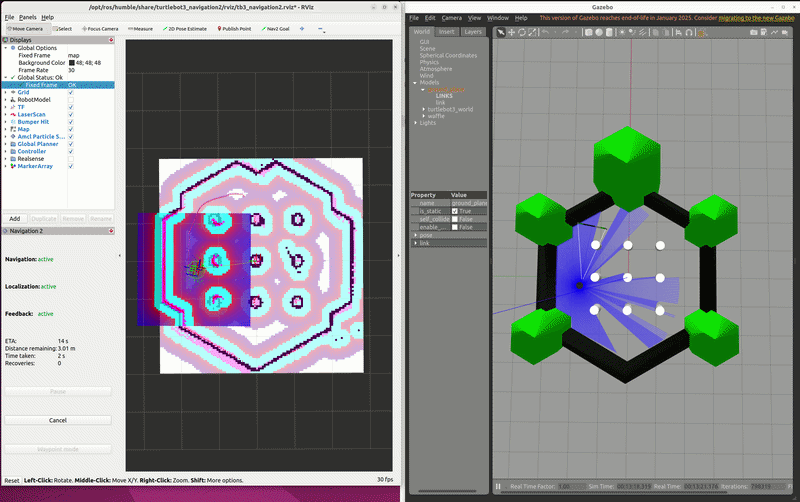

# Week 2 — Navigation Autonome avec ROS 2 & Gazebo

## Aperçu
Navigation autonome d'un robot mobile TurtleBot3 Waffle en simulation Gazebo.
Pipeline complet : cartographie SLAM → navigation autonome Nav2 + noeud ROS 2 custom pour joystick.

## Démo


## Stack Technique
- ROS 2 Humble
- Gazebo Classic 11
- TurtleBot3 Waffle
- SLAM Toolbox (mode async en ligne)
- Nav2 Stack
- Python / rclpy

## Résultats
- ✅ Carte 2D (occupancy grid) construite avec SLAM Toolbox
- ✅ Navigation autonome avec évitement d'obstacles (Nav2)
- ✅ Noeud ROS 2 custom : Joy → cmd_vel pour contrôle joystick

## Architecture

```
Simulation Gazebo
    ├── /scan   ──────────────→  SLAM Toolbox  →  /map
    ├── /odom   ──────────────→  Nav2 (AMCL)
    └── /cmd_vel  ←────────────  Nav2 Controller
                  ←────────────  joy_to_cmdvel  ←──  /joy (manette)
```

## Package : joy_to_cmdvel
Noeud ROS 2 custom convertissant les entrées joystick en commandes de vitesse.

```bash
# Compilation
colcon build --packages-select joy_to_cmdvel
source install/setup.bash

# Lancement
ros2 launch joy_to_cmdvel joy_launch.py
```

## Pipeline Navigation Complet

```bash
# 1. Simulation
ros2 launch turtlebot3_gazebo turtlebot3_world.launch.py

# 2. Navigation
ros2 launch turtlebot3_navigation2 navigation2.launch.py \
  use_sim_time:=true \
  map:=results/turtlebot3_map.yaml
```

## Carte Générée


## Environnement
- Ubuntu 22.04
- ROS 2 Humble
- Gazebo Classic 11.10.2
- TurtleBot3 Modèle : Waffle
