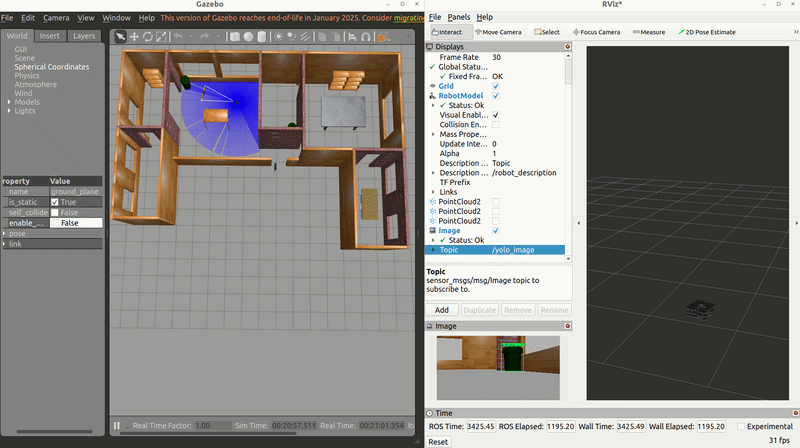

# Week 4 — Détection d'objets temps réel avec YOLOv8

## Aperçu
Intégration de YOLOv8 dans ROS 2 pour la détection d'objets en temps réel
sur le flux caméra du TurtleBot3 Waffle en simulation Gazebo.

## Démo


## Stack Technique

- YOLOv8n (Ultralytics 8.4.47)
- PyTorch 2.5.1 + CUDA
- OpenCV + cv_bridge

## Architecture

```
Gazebo (TurtleBot3 Waffle)
        |
        | /camera/image_raw
        ↓
yolo_detection_node
        |-- cv_bridge    : ROS Image → OpenCV
        |-- YOLOv8n      : Détection (80 classes COCO)
        |-- cv_bridge    : OpenCV → ROS Image
        |
        | /yolo_image
        ↓
      RViz2
```

## Package ROS 2 — yolo_detection

Nœud ROS 2 Python abonné au topic caméra du TurtleBot3.

### Pipeline

1. Abonnement à `/camera/image_raw`
2. Conversion `ROS Image → OpenCV` via `cv_bridge`
3. Inférence `YOLOv8n` avec seuil de confiance > 50%
4. Annotation de l'image (boîtes + labels + scores)
5. Publication sur `/yolo_image` pour visualisation RViz2

### Lancer le pipeline

```bash
# Terminal 1 — Simulation Gazebo
source /opt/ros/humble/setup.bash
export TURTLEBOT3_MODEL=waffle
ros2 launch turtlebot3_gazebo turtlebot3_house.launch.py

# Terminal 2 — Nœud YOLO
source /opt/ros/humble/setup.bash
source ~/robotics-portfolio/week4-yolo-detection/install/setup.bash
ros2 run yolo_detection yolo_node

# Terminal 3 — Téléopération
source /opt/ros/humble/setup.bash
export TURTLEBOT3_MODEL=waffle
ros2 run turtlebot3_teleop teleop_keyboard

# Terminal 4 — Visualisation
source /opt/ros/humble/setup.bash
rviz2
```

## Résultats

- Détection temps réel sur flux caméra ROS 2
- Classes détectées : chair, dining table, bottle...
- Modèle : YOLOv8n (6.2MB) — léger et rapide
- Note : faibles scores de confiance attendus en simulation
  (sim-to-real gap — modèle entraîné sur images réelles)

## Concepts clés maîtrisés

- Architecture YOLOv8 : détection en une seule passe
- Transfer Learning : utilisation de poids pré-entraînés COCO
- cv_bridge : pont ROS 2 ↔ OpenCV
- Seuil de confiance : filtrage des fausses détections
- Sim-to-real gap : différence simulation / monde réel

## Environnement

- Ubuntu 22.04
- ROS 2 Humble
- Gazebo
- NVIDIA RTX 4060 Laptop — 8GB VRAM

